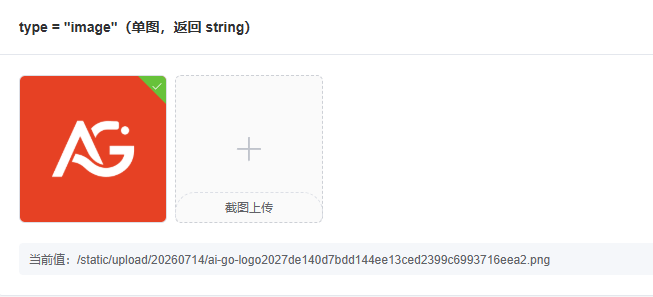
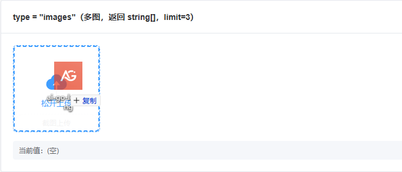
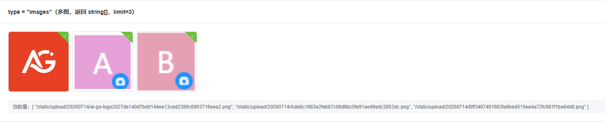
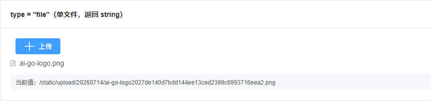
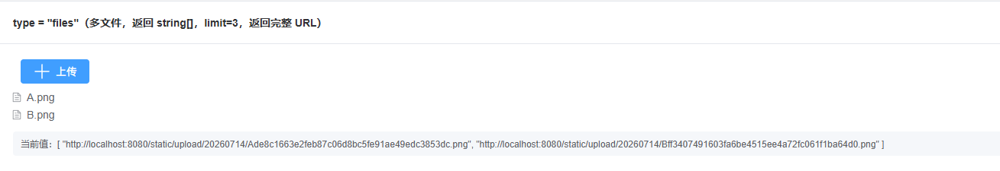

# 从 PHP 到 AI + Golang，程序员自救转型手记（三十九）：前端上传组件实现

这是一个系列 Blog，作者将以一个 PHP 全栈工程师的身份，利用 AI 工具（claude code、codex、deepseek、豆包等）：从零开始学习 golang 语言，并最终完成 ai-go-admin（[github](https://github.com/ai-go-hub/ai-go-admin) | [gitee](https://gitee.com/ai-go-hub/ai-go-admin)）开源项目的制作，全程记录分享。

在上一期，我们进行了 “获取资源完整路径的前后端函数实现”，本期将完成：前端上传组件实现

# 前端上传组件实现

在之前，我们已经准备好了上传接口，甚至准备好了前端上传请求函数，以及获取资源完整路径的 `fullURL` 函数。

上传是典型的大组件，因为涉及的功能非常多，希望 AI 能给力一点吧，现在直接让 AI 参考 BuildAdmin 的上传组件代码，该组件使用多年，受众多用户认可，提示词如下：

参考 `@../buildadmin-v2.3.7/web/src/components/baInput/components/baUpload.vue` 实现 `@web/src/components/agInput/` 的 `agUpload.vue` 组件：

1. 封装好的上传请求函数位于 `@web/src/api/common.ts`
2. `ba` 开头的 class、变量 等，都适应化的改为 `ag`，比如 `ba-upload-wrapper`
3. 原组件已标记废弃的 `props` 无需实现
4. 于 `@xxx/index.vue`（一个空白 vue 文件），生成使用示例，以便我测试。

总体来讲 AI 这次没有让人失望，虽然代码是现成的，但对工作效率的提升依旧非常恐怖：

AI 成功的将 `BuildAdmin` 上传组件的 `单图、多图、单文件、多文件` 功能**全部实现**。

且该组件原有的扩展功能，如：`剪切板粘贴上传`、`拖拽上传`、`拖拽排序`、`强制上传到本地等 props`、`插槽`、`各种事件` 等等，**全部成功移植**。

最关键的是它只做了适应化移植，并没有一通瞎改，这让上传这种大组件的人工 `review` 工作也变得相当容易（不过这可能也是我们任务拆分做的好的原因，哈哈）。

我直接利用代码对比工具进行了人工 `review`，并对细节处略作调整，这里提取一两处 AI 做的微调出来供大家欣赏（仅代码层面，非功能层面）：


> 这些修改，不是我让它改的，提示词没有提及任何需要让它改动或是优化的词语，都是它自己在整理过程中进行的修改，AI 版本好在哪里，欢迎大佬们评价。

```ts
const { oldIndex, newIndex } = evt

// 交换变量，原版
[state.fileList[oldIndex], state.fileList[newIndex]] = [state.fileList[newIndex], state.fileList[oldIndex]]

// AI 版
state.fileList[newIndex] = [state.fileList[oldIndex], (state.fileList[oldIndex] = state.fileList[newIndex])][0]
```

```ts
// 原版
const isImageType = () => props.type == 'image' || props.type == 'images'

// AI 版
const isImageType = computed(() => props.type == 'image' || props.type == 'images')
```

最终效果如下：









