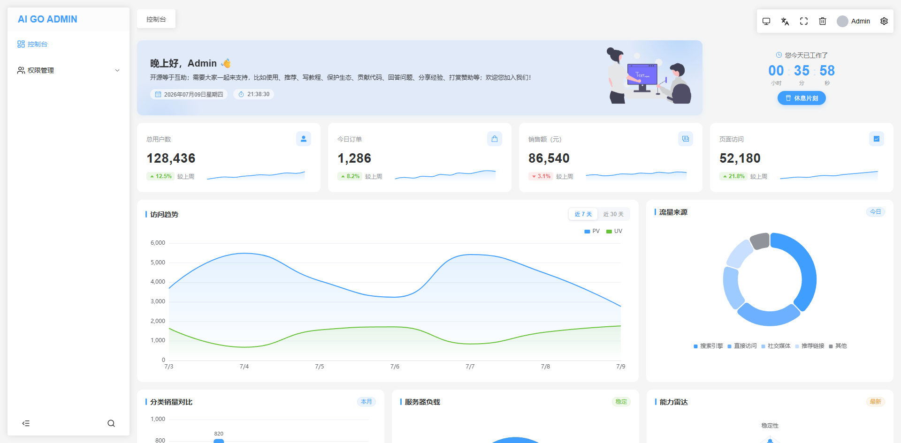
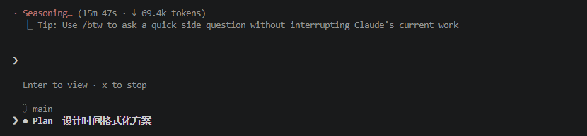

# 从 PHP 到 AI + Golang，程序员自救转型手记（三十五）：控制台静态页面、深入研究时间格式化方案

这是一个系列 Blog，作者将以一个 PHP 全栈工程师的身份，利用 AI 工具（claude code、codex、deepseek、豆包等）：从零开始学习 golang 语言，并最终完成 ai-go-admin（[github](https://github.com/ai-go-hub/ai-go-admin) | [gitee](https://gitee.com/ai-go-hub/ai-go-admin)）开源项目的制作，全程记录分享。

在上一期，我们进行了 “后台初始化请求实现”，本期将完成：控制台静态页面、深入研究时间格式化方案

# 控制台静态页面

后台系统，为了控制台好看，一般不会使用真实数据（比如会员数、插件数等），而是整一些花里胡哨的图表即可，相当于留给系统开发者自定义。

又是静态页面来了，上一次搞纯静态 AI 表现的很好，这一次提示词依旧很简单：于 `@web/src/views/admin/dashboard.vue` 实现静态控制台页面，展示一些静态数据，精致的图表等。

失算了，这次静态页面调了非常久，大概得 4 个小时+，推翻重构了很多，然后又人工打磨一些细节，和逐行 `review`，最终落地效果如下：



这一次几乎是每个卡片都做了修改，原版非常花哨，颜色杂乱，动效亮眼，也有布局不合理的地方，只是乍一看还行。

# 深入研究时间格式化方案

目前，如管理员上次登录时间 `last_login_at`，输出的格式是这样的：`2026-07-17T20:58:58.976277+08:00`，而我们的日常格式一般是：`2026-07-17 20:58:58`，这里让问问 AI，在什么地方改，以及怎么改。

> 我主要是不太确定 GORM 输出字段能是否自定义时间输出的格式，而如果可以，最好的方式应该是在模型层，设置 json 转换相关 tag。

> 同时鉴于我们之前已经建立了 `dto` 目录，这次应该刚好能将一些散乱在各处的 `响应数据结构体` 封装进去，不再和模型等层强耦合。

这里直接问 AI：**时间字段，如 `@internal/model/admin.go` `admin` 表的 `LastLoginAt` 字段，接口响应的格式是：`2026-07-17T20:58:58.976277+08:00`，我希望改为简洁一点的 `2026-07-17 20:58:58`，从哪里入手比较好？**

结果：



而且它最终提供的方案我还不太认可，大概是要自定义一个 `Time` 类型，嵌入 `time.Time`，实现很多时间转换的接口，然后将所有的 `time.Time` 字段类型改为 `Time`（这里还问了豆包，它首先也是这个思路😂）。

换了 AI 查资料，果然 `DTO` 层将 `time.Time` 字段转为 `string`，格式化为 `2023-02-05 09:09:09 ` 是完全可行的。

让 CC 先搓一个出来看看：在 `DTO` 层将 `time.Time` 字段转为 `string`，格式化为 `2006-01-02 15:04:05`，先做 `@internal/dto/admin.go` 中的 `AdminSession` 看看效果：

结果出了点问题，`dto` 层转换的话，以后每个带时间日期字段的 `dto` 都需要写 `MarshalJSON` 方法，这显得非常麻烦，我甚至又退回第一步再次确定了一下模型层转换是不是正确方案，但：

模型层确实需要坚持使用 `time.Time` 类型：

1. 担心 `GORM` 这边的兼容性问题，而且有出库入库的性能损耗
2. 时间没必要模型层就转换为合适的格式，自定义格式主要是展示用，你提前转了后面要用时间搞不好还得转回去，`dto` 层是最合适的
3. `gorm.DeletedAt` 这种又不能改用自定义的 `Time` 类型，这就显得不统一了
4. `dto` 可以随时分版本，模型怎么分版本？

所以，最终方案：后端在 `model` > `dto` 层的数据转换时，对时间进行格式化（而不是在 `json` 序列化时自动格式化）

> `DTO 层` 这个说法严格来讲是错误的，dto 只是一个存储数据对象的目录，只是有时候把它叫做 `层` 才能显得它里边也能搞点什么，而不是纯数据对象。

经过约 两小时的查资料、研究，终于找到了完美时间格式转换方案：

我们有 `dto` 层，`model` 本来就需要转 `dto`，只是 `json` 序列化时转换的写法又太啰嗦（每个 `dto` 都要写 `MarshalJSON`），最终：

1. 安装 `github.com/jinzhu/copier` 依赖，这是一个数据拷贝工具，可以方便的将 `model` 拷贝到 `dto`，避免将字段一一对应的硬编码
2. `copier` 在进行数据拷贝时，可以自定义一些转换器，据此，我创建了 `pkg/copierx` 包（`x` 是社区惯例，意思是 `copier` 的扩展），里边建立一个 `converter.go` 文件，存放所有的自定义转换器
3. 第一个转换器就是 `copierx.Time`，用于在数据装换时，将 `2006-01-02T15:04:05Z07:00` 转化为任意自定义的事件格式，用法如下

```go
if err := copier.CopyWithOption(&dto.Admin, adminModel, copier.Option{
    // time.DateTime 就是我们想要的格式
    Converters: []copier.TypeConverter{copierx.Time(time.DateTime)},
}); err != nil {
    return nil, "数据转换失败"
}
```

4. 不涉及时间的，还可以直接用 `copier.Copy`，涉及时间的就是上面这种 `copier.CopyWithOption` 的写法，然后将我们自定义的 `Time` 转换器放进去

> 大佬们，这是否是最完美的方案，你项目的时间格式转换方案是什么呢？