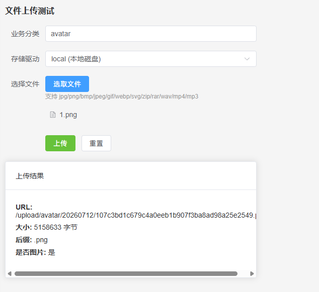

# 从 PHP 到 AI + Golang，程序员自救转型手记（三十六）：多驱动上传接口

这是一个系列 Blog，作者将以一个 PHP 全栈工程师的身份，利用 AI 工具（claude code、codex、deepseek、豆包等）：从零开始学习 golang 语言，并最终完成 ai-go-admin（[github](https://github.com/ai-go-hub/ai-go-admin) | [gitee](https://gitee.com/ai-go-hub/ai-go-admin)）开源项目的制作，全程记录分享。

在上一期，我们进行了 “控制台静态页面、深入研究时间格式化方案”，本期将完成：多驱动上传接口

# 多驱动上传接口

> 多驱动设计，但本次只实现 local 文件磁盘驱动，未来再考虑 COS / OSS 等驱动。

规划和给 CC 的提示词如下：

1. 增加 `config\upload.yaml` 配置文件，可配置 `最大上传大小`、`上传文件的后缀白名单`、`存储文件名格式化方法`（支持多个变量：`/{topic}/{year}{mon}{day}/{fileName}{fileSha1}{.suffix}`）
2. 增加 `internal\infra\upload\driver` 文件夹，用于存放上传驱动，首先实现一个 `local` 本地磁盘驱动，驱动拥有以下方法：
    - 保持文件 `Save` 方法，接受存储文件名参数，若存储的文件夹不存在则建立
    - 删除文件 `Delete` 方法
    - 获取资源地址 `Url` 方法
    - 获取文件是否存在 `Exists` 方法
    - 获取文件在磁盘上的完整存储路径 `FullPath` 方法
3. 增加 `internal\infra\upload\upload.go` 文件，实现上传服务 `NewService(driver Driver)`，内部实现 `newDriver` 方法，根据传入的驱动名称实例化对应驱动，然后实现 `文件上传`、`获取文件后缀`，`上传的文件是否为图片` 方法。
4. 文件上传方法需根据`config\upload.yaml` 配置检查文件大小、后缀白名单，并根据 `存储文件名格式化方法` 生成文件名。

初版实现之后，整理问题如下：

#### 文件白名单

AI 做出来的第一版，在文件后缀白名单为空时，允许上传任意文件，改为禁止上传任意文件，本系统也不设上传后缀通配符，比如 * 代码所有后缀，我们只有后缀白名单，允许的后缀必需一一列出。

#### 重大 BUG

又来了，没有 `review` 和人工测试是真不行啊，而且这次 `review` 期间还没发现，在效验文件大小时：

```go
// 校验文件大小逻辑
if cfg.MaxSize > 0 && header.Size > int64(cfg.MaxSize) {
  return nil, fmt.Errorf("文件大小 %d 超过最大上传限制 %d", header.Size, cfg.MaxSize)
}
```

```yaml
# 上传配置
upload:
  max_size: 10485760
```

```go
// 上传配置结构体
type UploadConfig struct {
	MaxSize     int
	Filename    string
	AllowSuffix []string `mapstructure:"allow_suffix"`
}
```

咋一看没啥问题，但上传配置结构体字段没加 `mapstructure` 标签，这里如果不加标签，`viper` 反序列化 `yaml` 时，对于这种带 `_` 的字段，是无法正常赋值的。

不能正常赋值也就罢了，AI 的 `校验文件大小逻辑`，需要 `cfg.MaxSize > 0` 才进行效验逻辑，也就说：**文件大小检查，被直接跳过了**

很明显，这又是一个非常严重的 bug，如果没有 review 和人工测试，问题可就大条了。

#### 文件名生成优化

我们设计了 `{fileName}` 文件名格式化变量，意思是上传时将存储路径配置中的 `{fileName}` 替换为实际文件名；但是有一个问题，我们不能使用完整的文件名，有时候文件名的长度可能会让你怀疑人生，所以必需只提取文件名的前 15 位，再拼接 `sha1` 等值存储。

其次是我们必需对文件名进行过滤，比如 `:@#?&=` 这些符号不利于在 URL 中使用，上传成功之后，文件可能是无法访问的。

最后，必需过滤掉正反斜杠，防止 `路径穿越` 攻击。

#### 开放更多方法

一个是 `检查某后缀是否在白名单之内` 的方法，另外一个 `生成文件名` 的方法，都是作为可以开放访问方法的，且私有有时反而不方便。

#### 驱动不是文件配置

AI 在上传配置文件中加了当前使用 `驱动` 的配置项，改为 Uplaod 方法手动传递，以便开发者能随时上传往不同的驱动上传文件。

额外再将 newDriver 直接公开，以便开发者可以获取到上传驱动实例，对文件进行增删改查操作。

#### 去重逻辑错误

`已存在则跳过（秒传去重）` 的逻辑，是根据文件名实现的，但文件名又带有 year 、mon 、day，所以重复的可能性很低，这里应该根据文件 `sha1` 值去重，此时才发现缺少 `附件` 模型和附件表，先添加，提供 SQL 即可，剩余交给 AI：

```sql
CREATE TABLE `attachment`  (
  `id` int UNSIGNED NOT NULL AUTO_INCREMENT COMMENT 'ID',
  `topic` varchar(20) CHARACTER SET utf8mb4 COLLATE utf8mb4_unicode_ci NOT NULL DEFAULT '' COMMENT '主题分类',
  `user_id` int UNSIGNED NOT NULL DEFAULT 0 COMMENT '上传用户ID',
  `user_type` varchar(50) CHARACTER SET utf8mb4 NULL DEFAULT NULL COMMENT '上传用户身份类型',
  `url` varchar(255) CHARACTER SET utf8mb4 COLLATE utf8mb4_unicode_ci NOT NULL DEFAULT '' COMMENT '存储路径',
  `name` varchar(120) CHARACTER SET utf8mb4 COLLATE utf8mb4_unicode_ci NOT NULL DEFAULT '' COMMENT '原始名称',
  `size` int UNSIGNED NOT NULL DEFAULT 0 COMMENT '大小',
  `mimetype` varchar(100) CHARACTER SET utf8mb4 COLLATE utf8mb4_unicode_ci NOT NULL DEFAULT '' COMMENT 'MIME类型',
  `quote` int UNSIGNED NOT NULL DEFAULT 0 COMMENT '上传（引用）次数',
  `driver` varchar(50) CHARACTER SET utf8mb4 COLLATE utf8mb4_unicode_ci NOT NULL DEFAULT '' COMMENT '存储驱动',
  `sha1` varchar(40) CHARACTER SET utf8mb4 COLLATE utf8mb4_unicode_ci NOT NULL DEFAULT '' COMMENT 'SHA1编码',
  `create_at` bigint UNSIGNED NULL DEFAULT NULL COMMENT '创建时间',
  `last_upload_at` bigint UNSIGNED NULL DEFAULT NULL COMMENT '最后上传时间',
  PRIMARY KEY (`id`) USING BTREE
) ENGINE = InnoDB AUTO_INCREMENT = 1 CHARACTER SET = utf8mb4 COLLATE = utf8mb4_unicode_ci COMMENT = '附件表' ROW_FORMAT = DYNAMIC;
```

#### 公共工具函数抽取

在截取文件名前 15 位时，定义了一个字符串截断函数 `func truncate(s string, n int) string`，这里将该函数改名为 `TruncateString`，并抽取到 `pkg\util\helper.go` 中，且未来如果 str 相关函数非常多，可以再单独建立 str 文件，而目前是不必要的。

另外将 `Suffix`（获取文件后缀）和 `IsImage`（判断后缀是否为图片）函数，抽到 `pkg\filesystem\filesystem.go`，同时：

1. `Suffix` 改名为 `Extension`
2. `IsImage` 改名为 `IsImageExtension`
3. 额外建立一个 `FormatBytes` 函数，可以将字节数格式化为易读单位（B/KB/MB/GB/TB/PB），并在文件大小超限的提示信息中使用

# 上传接口实现

公共接口并不会很多，目前已有的是：

`captcha.go` 文件: `/common/captcha/create`、`/common/captcha/verify`

还有暂未建立的接口有：`ext-svg`、`area`、`sms`、`ems`、`upload`

我们可以直接于 `@internal/handler/common/` 目录平铺的建立多个 `go` 文件即可，本次的上传对应的就是 `upload.go`，且不建立 `common.go` 存放多个不同的杂项接口，没有这种方式直观；能分类就分个类，不能分类的直接平铺。

这里要求 CC: 于 `@internal/handler/common/` 目录，建立 `upload.go` 文件，在其中创建 `/common/upload` 接口，使用 `@internal/infra/upload/upload.go` 文件上传服务实现文件上传。

#### 使用 AdminAuthOptional 中间件

出来的代码 `上传用户ID` 和 `上传用户类型` 都是空的，这里要求 AI 使用上管理员可选登录中间件，读取登录用户信息并写入。

上传接口默认设计为必须登录，但使用可选登录中间件，为了未来方便的扩展，额外使用如：`用户可选登录中间件`，`商户可选登录中间件`，后续是使用所有的可选登录中间件，然后在接口内部接受登录信息，一个都没有才拒绝上传。

#### 上传驱动从前端传递

目前接口中的上传驱动，是固定的 `local`，这里要求改为前端传递即可，因为都是公共桶，上传至何处并不重要；就算未来增加了 COS / OSS 驱动，居心不良的人将文件上传至不同存储桶了，也没有任何关系。

#### 最终测试

随便 @ 了一个空白 vue 文件，让 CC 在其中创建一个简易文件上传表单，以便我进行测试。



手动的对文件后缀限制、文件大小，改驱动及目录，文件存储名等进行了测试，没有发现其他问题，至此，多驱动文件上传接口就完工了。