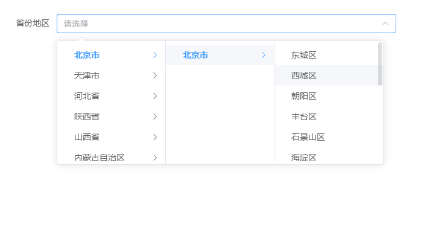

# 从 PHP 到 AI + Golang，程序员自救转型手记（五十五）：增加 area 接口和区域三联动选择组件

这是一个系列 Blog，作者将以一个 PHP 全栈工程师的身份，利用 AI 工具（claude code、codex、deepseek、豆包等）：从零开始学习 golang 语言，并最终完成 ai-go-admin（[github](https://github.com/ai-go-hub/ai-go-admin) | [gitee](https://gitee.com/ai-go-hub/ai-go-admin)）开源项目的制作（欢迎 `star`），全程记录分享。

在上一期，我们进行了 “管理员个人资料页面、管理员日志优化”，本期将完成：增加 area 接口和区域三联动选择组件



# 增加 area 接口

## 模型和迁移

直接从 BuildAdmin 那边复制过来建表 SQL，让 AI 帮忙写好模型和迁移，同时按照老规矩将 `AI GO ADMIN` 系统自带的杂项模型全部放在 `common.go` 即可，而不是分别存放，避免系统一开始就有大量的模型文件，提示词如下：

建立 `area` 表的迁移和模型：

迁移放在： `@cmd/migrate/migrations/000002_common.up.sql`
模型放在： `@internal/model/common.go`

参考 `SQL`:

```sql
CREATE TABLE `area`  (
    `id` int NOT NULL AUTO_INCREMENT COMMENT 'ID',
    `pid` int UNSIGNED NOT NULL DEFAULT 0 COMMENT '上级ID',
    `name` varchar(64) CHARACTER SET utf8mb4 COLLATE utf8mb4_unicode_ci NOT NULL DEFAULT '' COMMENT '名称',
    `level` tinyint UNSIGNED NOT NULL DEFAULT 0 COMMENT '等级',
    `code` varchar(10) CHARACTER SET utf8mb4 COLLATE utf8mb4_unicode_ci NOT NULL DEFAULT '' COMMENT '行政区划代码',
    `zip` varchar(6) CHARACTER SET utf8mb4 COLLATE utf8mb4_unicode_ci NOT NULL DEFAULT '' COMMENT '邮编',
    PRIMARY KEY (`id`) USING BTREE
) ENGINE = InnoDB AUTO_INCREMENT = 1 CHARACTER SET = utf8mb4 COLLATE = utf8mb4_unicode_ci COMMENT = '省份地区表' ROW_FORMAT = DYNAMIC;
```

-------------------------------------------------------------------------------------------

AI 建好的模型如下，它估计是看到其他模型都有定义 `TableName` 方法，这里也直接写上了，这是对的：

```go
// Area 省份地区模型
type Area struct {
	ID    uint   `gorm:"comment:ID;primarykey;autoIncrement" json:"id"`
	Pid   uint   `gorm:"comment:上级ID;not null;default:0;index" json:"pid"`
	Name  string `gorm:"comment:名称;type:varchar(64);not null;default:''" json:"name"`
	Level uint8  `gorm:"comment:等级;not null;default:0;index" json:"level"`
	Code  string `gorm:"comment:行政区划代码;type:varchar(32);not null;default:''" json:"code"`
	Zip   string `gorm:"comment:邮编;type:varchar(32);not null;default:''" json:"zip"`
}

// TableName 指定 Area 模型表名
func (Area) TableName() string {
	return "areas"
}
```

迁移 SQL 如下：

```sql
-- ===== areas 省份地区表 =====
CREATE TABLE IF NOT EXISTS "__PREFIX__areas" (
    "id"    bigserial PRIMARY KEY,
    "pid"   bigint NOT NULL DEFAULT 0,
    "name"  varchar(64) NOT NULL DEFAULT '',
    "level" smallint NOT NULL DEFAULT 0,
    "code"  varchar(32) NOT NULL DEFAULT '',
    "zip"   varchar(32) NOT NULL DEFAULT ''
);
CREATE INDEX IF NOT EXISTS "__PREFIX__idx_areas_pid" ON "__PREFIX__areas" ("pid");
CREATE INDEX IF NOT EXISTS "__PREFIX__idx_areas_level" ON "__PREFIX__areas" ("level");
COMMENT ON TABLE "__PREFIX__areas" IS '省份地区数据表';
COMMENT ON COLUMN "__PREFIX__areas"."id" IS 'ID';
COMMENT ON COLUMN "__PREFIX__areas"."pid" IS '上级ID';
COMMENT ON COLUMN "__PREFIX__areas"."name" IS '名称';
COMMENT ON COLUMN "__PREFIX__areas"."level" IS '等级';
COMMENT ON COLUMN "__PREFIX__areas"."code" IS '行政区划代码';
COMMENT ON COLUMN "__PREFIX__areas"."zip" IS '邮编';
```

迁移中是不含具体的省市区数据的，因为该数据量过于庞大，内置在框架内并不合适，未来使用单独的 SQL 提供，开发者按需下载即可，这里提供一个种子数据实例：

```sql
INSERT INTO areas VALUES (1, 0, '北京市', 1, '110000', '100000');
INSERT INTO areas VALUES (2, 1, '北京市', 2, '110100', '100000');
INSERT INTO areas VALUES (3, 2, '东城区', 3, '110101', '100010');
INSERT INTO areas VALUES (4, 2, '西城区', 3, '110102', '100032');
INSERT INTO areas VALUES (5, 2, '朝阳区', 3, '110105', '100020');
INSERT INTO areas VALUES (6, 2, '丰台区', 3, '110106', '100071');
```

目前省份地区数据还并未同步到最新版本，不过这其实是好事，听完狡辩你就懂了，我已经找到了权威的数据源，已经有更新的方法，只缺落实，当实际需要落实时就会发现，现有数据中的每一行：
1. 不能删：一旦删除 ID 号得重排不说，使用了改 ID 的关联数据还会丢失关联
2. 不能直接去改区域的名字等，改了还是会影响关联

这是你会说，现在是新项目，不存在关联数据啊，那么这时你就得再考虑深一步，本次改好了：未来省份地区数据又更新了呢？

解决方案其实只能标记记录状态，下次增加一个 `status` 字段，将 `删除、改名` 的数据全部标记为过时，不影响关联，而前端省份区域选择组件又不读取过时数据即可，新增的区域则直接插入到末尾，这次的偷懒，反而是为之后规范化更新铺路。

## 增加 area 接口

直接让 AI 参考 `@../ba238/app/api/controller/Ajax.php` 的 `area` 方法，分析其内部的 `get_area` 函数，实现本项目的 `@internal/handler/common/util.go` 的 `area` 接口。

最终代码如下，大白话就是根据传入的 `province` 和 `city` 获取下级区域数据：

```go
// Area 获取省份地区数据
func Area(c *gin.Context) {
	city := c.DefaultQuery("city", "")
	province := c.DefaultQuery("province", "")

	pid := 0
	level := 1
	if province != "" {
		pid, _ = strconv.Atoi(province)
		level = 2
		if city != "" {
			pid, _ = strconv.Atoi(city)
			level = 3
		}
	}

	areas, err := repoCommon.NewAreaRepository().FindByPidAndLevel(c.Request.Context(), pid, level)
	if err != nil {
		httpx.Fail(c, httpx.WithMessage("地区数据查询失败"))
		return
	}

	httpx.Success(c, httpx.WithData(areas))
}
```

其实最开始 AI 并没有建立对应的仓储，而是直接使用 `GORM` 的查询语句，在控制器内完成了查询，后来一句提示词解决：建立 area 对应的仓储，并使用仓储进行查询，建立位置： `@internal/repository/common/`

# 增加 area 选择三联动公共组件

刚刚才实现了 area 接口，保持住上下文，赶紧让 AI 继续做组件：参考 `@../ba238/web/src/components/baInput/index.vue` 的 `type=city` 的代码，实现本项目的 `@web/src/components/agInput/components/areaSelect.vue` 组件

是的，这里是将参考的一个 type 逻辑，抽为单独的组件，目前我们封装的输入组件就有：`areaSelect`、`agUpload`、`array`、`iconSelect`、`remoteSelect` 这五种了，都是组件库没有的，比如 el-input 这种我们不需要再额外封装，AI时代多余的封装造成的理解成本都是在浪费 token（不过未来会有一个统一入口 `agInput/index.vue` 组件，直接传 `type` 就能渲染对应的输入框，只用于动态表单的场景，平常不用）。

打完这段 blog，AI 那边也做好了，组件没啥特殊的，主要是使用了 `el-cascader`，样式如本文开篇的图片。

组件中还有一个节点缓存的功能，对已经请求过的节点进行缓存，我看到AI使用了 `reactive` 包裹缓存数据，这完全是没有必要的，让它去除：

```bash
有道理。nodeCache 只做数据暂存，不在模板中渲染，也不作为响应式依赖被 computed/watch 消费，用普通对象即可。同理 lastLazy 也可以简化。
```

然后是 AI 为绑定值写了 `set`：

```ts
const selectedValue = computed({
    get: () => props.modelValue ?? [],
    set: (val) => emit('update:modelValue', val ?? []),
})
```

同时又在 `el-cascader` 写了 `onChange` 事件，里边再次执行 `emit('update:modelValue', val ?? [])`，这也是多余的，除非触发了 `emit`，让它改正。

今天 AI 智商有点低啊，总共没几行代码，还全是前端，居然状况频出。

# 增加重置表单的公共函数

它本身没啥复杂的，主要是记录一个使用细节：表单的初始值（重置后的值）使用的是通过 `formRef.value.setInitialValues()` 设置的，未设置则将表单第一次被渲染时的绑定值作为初始值。

```ts
/**
 * el-form 表单重置
 * @param formEl
 */
export const resetForm = (formEl?: FormInstance | null) => {
    // resetFields 对该表单项进行重置，将其值重置为初始值并移除校验结果
    typeof formEl?.resetFields == 'function' && formEl.resetFields()
}
```