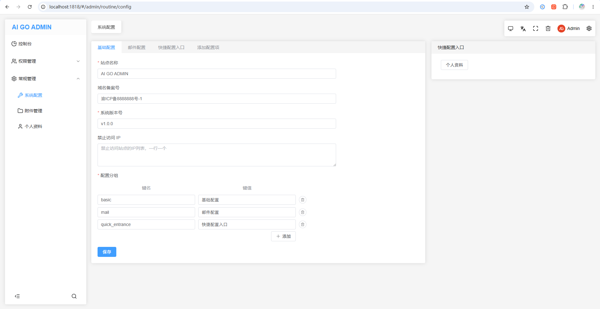
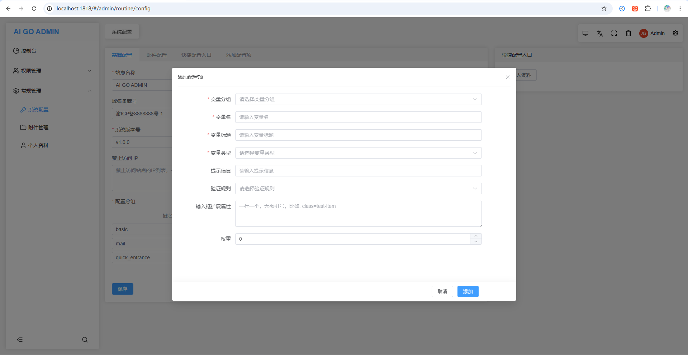

# 从 PHP 到 AI + Golang，程序员自救转型手记（五十八）：后台系统配置管理实现

这是一个系列 Blog，作者将以一个 PHP 全栈工程师的身份，利用 AI 工具（claude code、codex、deepseek、豆包等）：从零开始学习 golang 语言，并最终完成 ai-go-admin（[github](https://github.com/ai-go-hub/ai-go-admin) | [gitee](https://gitee.com/ai-go-hub/ai-go-admin)）开源项目的制作（欢迎 star~），全程记录分享。

在上一期，我们进行了 “agInput 统一入口，动态表单预备”，本期将完成：后台系统配置管理实现

# 后台系统配置管理实现

让 AI：参考 `@../ba238/web/src/views/backend/routine/config/index.vue` 实现本项目的 `@web/src/views/admin/routine/config/index.vue` 页面（系统配置功能）

1. 服务端系统配置对应的模型位于 `@internal/model/common.go` ，迁移文件位于 `@cmd/migrate/migrations/000002_common.up.sql`
2. 根据模型建立对应的 `@internal/handler/admin/routine/config.go` 控制器和对应的仓储、服务
3. 服务端对应的 `php` 代码参考位于 `@../ba238/app/admin/controller/routine/Config.php`



这次 AI 写的代码，`review` 后，基本上都放弃了😂，然后人工慢慢搞了一整天，主要还是因为系统配置项可以在后台动态增加，也就是 `动态表单`，我们的 `agInput` 支持多达 `25` 中表单类型，各个输入组件的绑定值类型又各有不同，go 还对类型非常严格，想直接从 PHP 那边迁移过来非常不稳健。

在正式开始制作之前，人工逐一对输入组件的绑定值类型进行了确定和整理，比如：

### 上传等输入组件绑定值不支持 null

这时由于系统配置表的 `value` 是支持 `null` 的（`*string` 指针有指针的好处，不再赘述），这里的选择是让这些输入组件统一支持到 `null`。

为 `null` 做出入库前转换是不可能的，那样会多很多样板代码。

### 输入组件绑定值类型为数组

`selects`、`图片多选`、`文件多选` 等，都是返回数组，但是系统配置表的 `value` 是固定的 `string`（不能改支持数组直接存储的类型，那样反过来 `string` 类型又有问题了）；

对于 `图片多选` 和 `文件多选`，加强了组件内部的绑定值机制，多选时如果传入的是字符串或空数组，输出的绑定值就用这样的格式 `a.png,b.png`，即传入字符串，哪怕是多选，也输出逗号分割的字符串。

对于 `select 多选` 和 `checkbox`，它们是组件库提供的原生组件，没法二开，那就只能转换了，不过这里依旧没选择服务端转换，**而是前端在获取和保存数据前进行转换**，`remoteSelects` 和 `array` 同理，number 类型的转换同理，为了方便转换，还于 `src\components\agInput\index.ts` 定义好了 `输入框的绑定值类型` 映射，如下：

```ts
/**
 * 输入框的绑定值类型
 * 组件输出值的类型，可能支持输出多种类型，此处列出的是推荐类型
 */
export const inputModelValueTypes = {
    number: ['number', 'switch', 'remoteSelect'],
    array: ['checkbox', 'array', 'selects', 'remoteSelects'],
    string: ['其他都支持 string，此处不再列出'],
}
```

### 输入组件扩展属性

在添加配置项时，还可以填写 `输入组件的扩展属性`，比如自定义 `class、pk、remote-url` 等：



值不需要带引号，一行一个，支持 `字符串、数字、布尔值`：

1. `class=test`
2. `pagination=false`
3. `level=3`

对这些扩展属性的解析，是直接在前端完成的，让 AI 实现的将 `属性字符串解析为 JSON` 的函数如下：

```ts
/**
 * 将字符串属性列表转为对象
 * 一行一个 key=value 键值对，支持 bool、数字自动转换，支持点号嵌套
 */
export const parseStrAttr = (attr: string): Record<string, any> => {
    const result: Record<string, any> = {}
    if (!attr) return result

    const lines = attr.replace(/\r\n/g, '\n').trim().split('\n')
    for (const line of lines) {
        const trimmed = line.trim()
        if (!trimmed) continue

        const eqIdx = trimmed.indexOf('=')
        if (eqIdx <= 0) continue

        const key = trimmed.slice(0, eqIdx).trim()
        let value: any = trimmed.slice(eqIdx + 1).trim()

        if (value === 'false') value = false
        else if (value === 'true') value = true
        else if (value !== '' && !isNaN(Number(value))) value = parseFloat(value)

        if (key.includes('.')) {
            set(result, key, value)
            continue
        }
        result[key] = value
    }
    return result
}
```

### 数据验证

添加新的系统配置时，支持选择配置的数据验证方法，前端大概是这样应用这些验证规则的：

```vue
<template>
    <div>
        <!-- 表单上绑定 rules 和 model -->
        <el-form :rules="state.rules" :model="state.form"></el-form>
    </div>
</template>

<script setup lang="ts">
import { buildValidatorRule, type BuildValidatorParams } from '/@/utils/validate'

// 在从服务端获取到配置数据后组装验证规则数据
let rules: Partial<Record<string, FormItemRule[]>> = {}

for (const key in state.config) {
    for (const lKey in state.config[key].configs) {
        if (state.config[key].configs[lKey].rule) {
            let ruleStr = state.config[key].configs[lKey].rule.split(',')
            let ruleArr: AnyObj = []
            ruleStr.forEach((item: string) => {
                ruleArr.push(
                    buildValidatorRule({ name: item as BuildValidatorParams['name'], title: state.config[key].configs[lKey].title })
                )
            })
            rules = Object.assign(rules, {
                [state.config[key].configs[lKey].name]: ruleArr,
            })
        }
    }
}
</script>
```

### 只提交当前 tab 的数据

如一开始的图片，系统配置有多个 `tab`，分为 基础配置、邮件配置 等，如果每次都提交全部的话，验证信息会隔 `tab` 显示，且只提交当前 `tab` 也更加合理，实现方式如下：

前端提交表单时：

```ts
// 只提交当前tab的表单数据
const formData: AnyObj = {}
for (const key in state.config) {
    if (state.config[key].name != state.activeTab) {
        continue
    }
    for (const lKey in state.config[key].configs) {
        const { type, name } = state.config[key].configs[lKey]

        // 组装需要提交的数据
        formData[name] = state.form[name] ?? ''
    }
}
```

组装出来的请求体大概是：

```ts
{
    name: 'AI GO ADMIN',
    version: 'v1.0.0',
    // ......
}
```

虽然已经是只有当前 tab 的键值对了，不过额外还是发送了当前的 `tab` 名称， 对于服务端来说，`tab` 名称就是 `group`，执行更新的时候，加入 `group=tab name` 的 `where` 即可。
