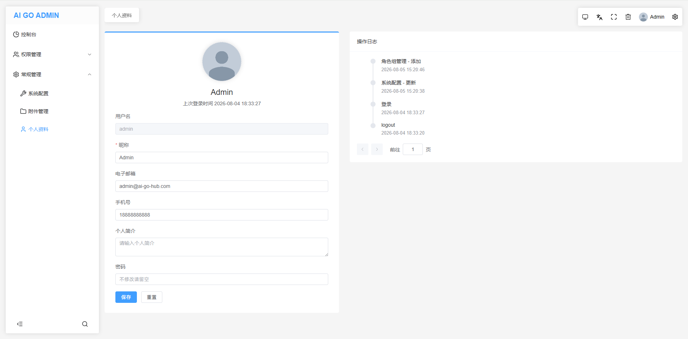
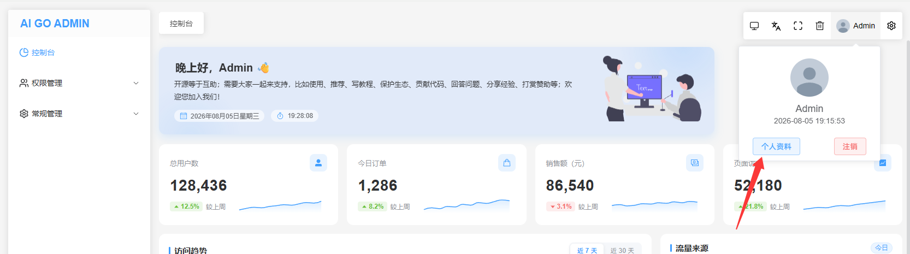

# 从 PHP 到 AI + Golang，程序员自救转型手记（五十四）：管理员个人资料页面、管理员日志优化

这是一个系列 Blog，作者将以一个 PHP 全栈工程师的身份，利用 AI 工具（claude code、codex、deepseek、豆包等）：从零开始学习 golang 语言，并最终完成 ai-go-admin（[github](https://github.com/ai-go-hub/ai-go-admin) | [gitee](https://gitee.com/ai-go-hub/ai-go-admin)）开源项目的制作（欢迎 `star`），全程记录分享。

在上一期，我们进行了 “管理员日志管理和日志中间件”，本期将完成：管理员个人资料页面、管理员日志优化

# 管理员个人资料页面

虽然我们已经提供了管理员账号管理功能，但是并不会为每个管理员都分配该功能的权限，所以需要一个额外的页面，供管理员自行修改昵称、头像、密码等，如下：



## 左侧个人资料表单

表单本身没啥特别的，直接交给 AI 即可，但这里为了防止 AI 用错上传组件（比如它自己去封装一个上传什么的），额外将已封装好的 `src\components\agInput\components\agUpload.vue` `@` 给它。

接下来就是个人资料 `查看` 和 `更新` 的权限和接口设计：

**权限方面**：虽然是管理员的 `个人资料`，但毕竟是后台菜单之一，直接总是显示（有权限）的也是不合理的，干脆也建立权限节点，让超管自行分配，增强超管的可控性。

**接口方面**：（同时是给 AI 的提示词）可直接复用 `管理员账号管理` 功能中已经实现的 `get` 和 `update` 接口（主要是修改密码的逻辑），但复用也有技巧，最好是新建控制器，注册为不同的路由名称，以便实现 `权限方面` 的管控，新的控制器内再嵌入 `管理员账号管理` 的服务即可，非常重要的是：**个人资料控制器中的 `get` 和 `update`，首先就检查被更新的 id 是不是当前登录管理员的，否则直接返回无权限**。

另外就是个人资料入口其实不只左侧菜单，还有右上角资料面板：



好在我们之前已经写好了前端的 `auth` 函数，使用它可实现无个人资料的权限时不再显示该按钮。

## 右侧操作日志展示

右边的操作日志可以直接调 `权限管理 > 管理员日志管理` 的 `list` 接口，为了方便个人资料页面调用，该接口已经配置了无需鉴权，而为了防止越权，该接口的服务层内部额外做了限制，非超管则仅能查出自己的操作日志。

不过前端读日志还是要额外传递一个 `where` 限定查询范围，因为这是个人资料页面，超管也不应该显示出其他管理员的日志，如下：

```ts
const getLog = () => {
    state.logLoading = true

    /**
     * 仅查询当前管理员日志
     * 1. 日志接口服务端层面已做限制，非超管仅能查询到自己的操作日志，所以不存在越权的问题
     * 2. 此处的筛选是针对超管的，因为个人资料页面，超管也不应该显示其他管理员的日志
     */
    state.logFilter.wheres = [
        {
            wheres: [
                {
                    field: 'admin_id',
                    value: adminInfoStore.id,
                    operator: 'eq',
                },
            ],
            or: false,
        },
    ]

    getAdminLog(state.logFilter)
        .then((res) => {
            state.log = res.data.data.list
            state.logTotal = res.data.data.total
        })
        .finally(() => {
            state.logLoading = false
        })
}
```

# 日志和个人资料路由更名

目前管理员日志的路由和接口路径为 `auth/adminLog`，入口组件名称为 `auth/adminLog/index.vue`，这些名称继承自 `BuildAdmin`，照理说按照规范，我们需要将其改名为 `auth/admin-log`，但我选择直接大胆的将其简化为 `auth/log`，我确定这个新名称的含义和唯一性已经足够了，主要是好看得多。

同上 `routine/adminInfo`，直接改为 `routine/profile`。

至此，系统自带的：前端路由路径、后端接口路径，全部都是单词了，没有多个单词的情况。

> PS：如果有多个单词，如：`adminLog` 改为 `admin-log` 是 `HTTP URL、路由路径` 本身推荐的规范，以前没注意到，现在全新项目，当然是遵守一下比较好。
