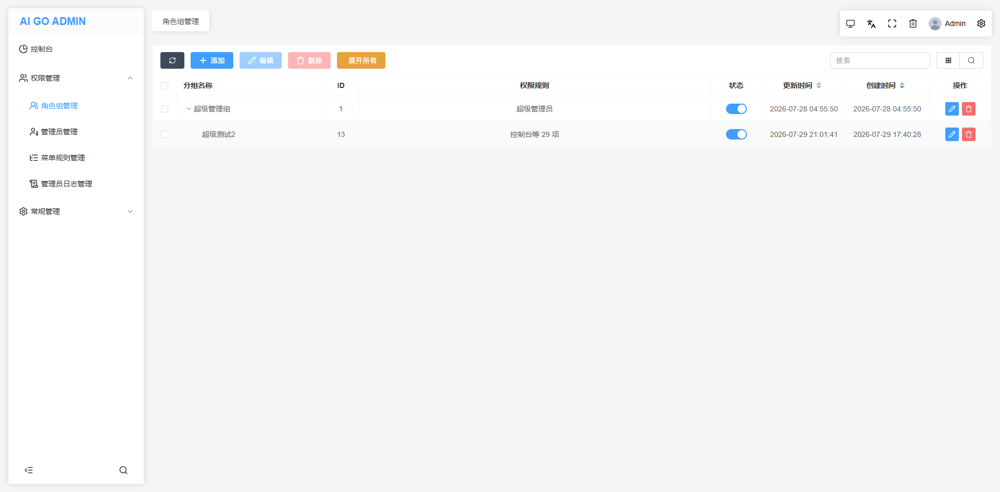
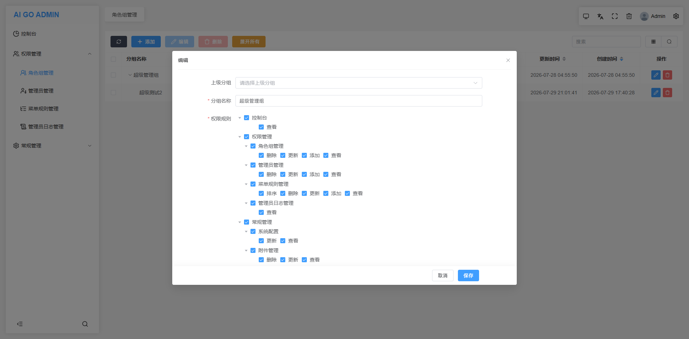

# 从 PHP 到 AI + Golang，程序员自救转型手记（五十）：增加管理员角色组管理

这是一个系列 Blog，作者将以一个 PHP 全栈工程师的身份，利用 AI 工具（claude code、codex、deepseek、豆包等）：从零开始学习 golang 语言，并最终完成 ai-go-admin（[github](https://github.com/ai-go-hub/ai-go-admin) | [gitee](https://gitee.com/ai-go-hub/ai-go-admin)）开源项目的制作，全程记录分享。

在上一期，我们进行了 “多条件组筛选、字段白名单”，本期将完成：增加管理员角色组管理

# 增加管理员角色组管理

我们之前已经建立好了 `菜单规则管理` 和 `管理员账号管理`，下一步再制作好 `管理员角色组管理`，`RBAC` 权限模型就基本完善了，这个权限模型非常简单，最核心的是：`用户`、`角色`、`权限` 的三层关联，其中 `用户` 并不直接跟权限挂钩，而是先建立 `角色组`，将具体的 `权限节点` 分配给 `角色组`，然后将 `角色组` 分配给 `用户`，它还有以下细节：

1. 一个角色组可以有多个权限节点
2. 一个用户可以属于多个角色组
3. 一个权限也可以被分配给多个角色

受益于之前已经准备好的服务端基类和前端的 `table` 组件及表格管家 `hook`，我们这次基本上只需要考虑核心业务，其他的基本功能都是唾手可得的，首先直接让 AI 参考之前已有的 CRUD 实现角色组管理的基本功能，就像建立 `菜单规则管理实现` 时一样，然后从基础的 CRUD 开始角色组功能特有的特性开发，为了让读者脑海里有概念，这里提供两张成品图：





## 重写服务层 Create 方法

在基础的 `CRUD` 上，额外对一个 `角色组` 设定的权限规则进行处理和检查：

1. 首先是对分组基础信息中的 `上级分组不能是自身`、`上级分组不存在` 的检查。
2. 如果输入的权限节点包含了系统所有的权限节点，则将权限节点直接折叠为 `*` 通配符号，而不再单独的存储所有权限节点的 id 号（即超管，好处是新增的权限节点，不再需要额外向超管级分组追加）。
3. 这一点是重中之重：对输入权限节点进行检查，首先是非超管不能建立超管级分组，其次是普通管理员能分配给新组的权限，必需是自己拥有的。

## 重写服务层 Update 方法

和以上 Create 方法类似，额外检查上级分组，不能是自己的子级分组（含直接子级、间接子级）避免形成环。

## 重写服务层 Delete 方法

主要是防止出现游离分组，能被删除的分组，必需没有子级，或使用批量删除连同所有子级一起删。

## 重写服务层 List 方法

这下基本上是全部重写了😂。

List 方法这边主要也是权限相关，即：只读取当前管理员 `拥有全部权限的角色组`，但凡某个角色组有一个权限节点不属于他，就不能让他查看。

这里有个小坑，不能是：读取当前管理员拥有的分组（因为管理员可以拥有多个分组，只读取自己拥有的分组看起来是合理的，但是会出现比如：当前管理员有 `角色组管理` 的权限，自己操作添加了一个分组，那么这个分组就必须分配给当前管理员，否则他查都查不到 等情况）

## 重写控制器 List 方法

从图中可以看出来，这次的列表也是支持树状表格的，如果单这一点的话，我们还可以使用 `List 数据适配函数` 对输出的数据进行格式化；

不过这次我们还得查出 `权限规则` 字段的摘要文本，比如 `控制台等 29 项` 这种字样，目前在 `List 数据适配函数` 中不能访问到服务层实例，所以选择直接重写控制器 List 方法，核心的代码如下：

```go
// List 覆写通用列表方法: 追加 rules_title 摘要字段，并渲染为树状结构
func (h *AuthAdminGroupHandler) List(c *gin.Context) {

    // ......

    // 批量构建每个分组的 rules 摘要文本（例如: 控制台等 60 项）
    titles, err := h.svc.BuildRulesTitles(c, groups)
    if err != nil {
        httpx.Fail(c, httpx.WithMessage("规则标题查询失败: "+err.Error()))
        return
    }

    // 转 map 以备后续树状数据组装，并注入 rules_title
	groupData := make([]map[string]any, len(groups))
	for i := range groups {
		m := groups[i].ToMap()
		m["rules_title"] = titles[groups[i].ID]
		groupData[i] = m
	}

	var list []map[string]any
	if opts.Selector {
		list = tree.Render(groupData, "id", "pid", "name")
	} else {
		list = tree.Build(groupData, "id", "pid", "children")
	}

	httpx.Success(c, httpx.WithData(gin.H{
		"list":  list,
		"total": total,
	}))

    // ......
}
```

如上，主要是调用了服务层的 `BuildRulesTitles` 方法，以及最后输出时根据 `opts.Selector`（请求是否来自选择器）输出为不同的树状数据，其中 `BuildRulesTitles` 方法用于提取 `权限规则` 的中文摘要，规则入库的是 `ids`，前台展示 `1,2,3` 肯定没有 `控制器等 20 项` 好看。

## 重写控制器 Get 方法

这一点是为了适配前端 `el-tree` 组件的数据格式，在编辑一个角色组时，特意将规则中的：所有父级节点去除，这些父级节点的选中状态由子级决定